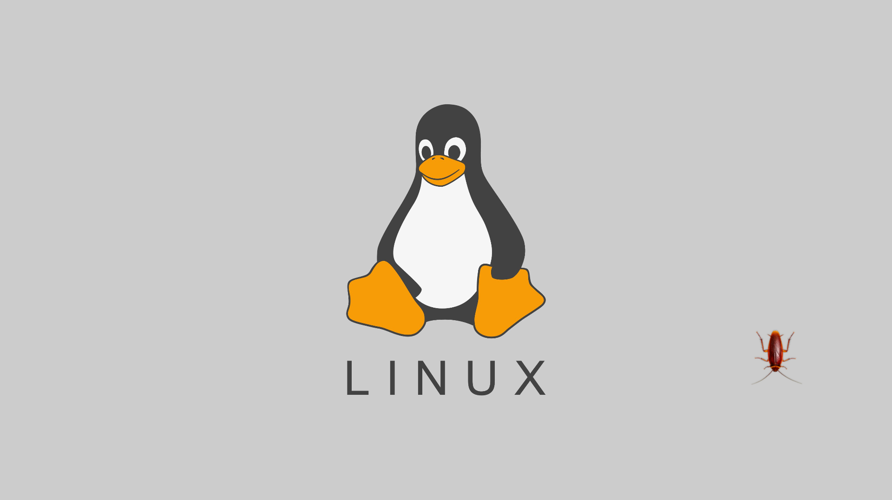

# Roach on Desk · 蟑螂桌宠



一只写实的蟑螂趴在你的 Windows 桌面上。它会在屏幕上慢慢爬行、偶尔停下来发呆，会被你抓住、被鼠标吓到逃跑，拖到屏幕边缘还会藏起来只露两根触须。它还能**帮你回收文件**：把不想要的文件拖给它，它会"吃掉"并收进自己的回收站，随时可以恢复。

**完全离线** —— 没有 Agent、没有模型接口、没有账号、没有遥测、没有任何网络请求。

## ✨ 功能

### 桌面宠物
- **自动游走**：缓慢爬行、偶尔停下发呆；跑累了会**完全休眠**，鼠标靠近它才醒来
- **可拖拽**：按住它就能抓住拖动，松手落地
- **鼠标靠近逃跑**：把鼠标靠近，它会受惊逃开
- **连点挣扎**：快速连点，它会挣扎
- **拖到边缘收边**：拖到屏幕边缘松手，它藏起来只露两根触须，点击触须它会爬出来
- **跟随系统事件**：锁屏/挂起时隐藏，解锁/恢复后出现；CPU 高负载时会警觉

### 文件回收站
- 从文件管理器**拖拽文件或文件夹**到蟑螂身上
- 弹出**二次确认**，确认后蟑螂"吃掉"（移动到应用自己的回收站，**非永久删除**）
- 在设置 →「回收站」里可**逐个恢复**回原位置，或**清空**

### 设置面板
- **独立的设置窗口**（不影响蟑螂位置）
- 左侧边栏：行为 / 系统 / 回收站 / 关于
- 每个功能都有开关：自动游走、可拖拽、鼠标靠近逃跑、连点挣扎、边缘收边、跟随系统事件
- **显示模式**：置顶显示 / 只在桌面显示（可被其他窗口挡住）

## 🎮 操作

| 操作 | 效果 |
| --- | --- |
| 左键按住拖拽 | 抓住并拖动 |
| 快速连点 | 挣扎逃跑 |
| 拖到屏幕边缘松手 | 藏起来只露触须 |
| 点击露出的触须 | 从边缘爬出来 |
| 拖拽文件/文件夹到它身上 | 回收文件（二次确认） |
| 右键托盘图标 | 打开设置 / 退出 |
| `Ctrl + Shift + H` | 隐藏 |
| `Ctrl + Shift + R` | 重新显示 |

## 📦 安装

从 [Releases](https://github.com/Jov3c/Dpet/releases) 下载：

- **Roach-on-Desk-xxx-portable.exe**：单文件便携版，双击即用，无需安装
- **Roach-on-Desk-xxx-Setup.exe**：NSIS 安装包，可自定义安装目录、创建快捷方式

> 首次运行若提示 Windows 安全警告，点「更多信息」→「仍要运行」即可（未做代码签名）。

设置文件保存在 Electron 的本机用户数据目录（`%APPDATA%`），不会上传任何数据。

## 🛠 开发

需要 [Node.js](https://nodejs.org/) 18+。

```powershell
npm install     # 安装依赖
npm start       # 运行
npm test        # 运行测试（18 项）
npm run lint    # 离线与语法检查
npm run dist    # 打包：便携版 + NSIS 安装包（输出到 dist/）
```

### 项目结构

```
src/
  main.js                  # 主进程：窗口、托盘、IPC、回收站
  recycle-bin.js           # 应用回收站：回收/列出/恢复/清空
  preload.js               # 安全桥接
  renderer/
    index.html + app.js    # 宠物窗口（渲染 + 交互 + 拖拽回收）
    settings.html + settings.js  # 独立的设置窗口
    pet-controller.mjs     # 宠物状态机（游走/逃跑/休眠/收边）
    pet-view.mjs           # 宠物视觉（APNG + 触须 peek）
    styles.css
assets/
  roach-topdown/           # 运行时用的俯视蟑螂 APNG 素材与主题
  roach/                   # 原创 SVG 素材（预览用）
  roach-photo/             # 照片写实素材（预览用）
tests/                     # 状态机、主题、契约等测试
scripts/                   # 素材构建、校验、打包脚本
```

## 🧪 技术

- **Electron** —— 透明、无边框、置顶的桌面窗口
- **Node.js 内置测试** —— `node --test`
- **electron-builder** —— Windows 便携版 + NSIS 打包
- 纯本地渲染，无任何网络依赖

## 📄 版本

- **v0.1.0** —— 首个发布：桌面宠物 + 回收站 + 设置面板
- **v0.1.1** —— 设置改为独立窗口，不再移动/缩放宠物窗口
